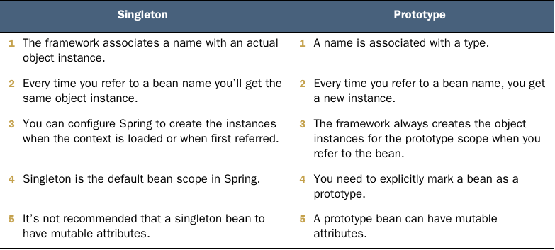

# Chapter 5. The Spring context: Bean scopes and life cycle

- The singleton bean scope defines Spring’s default approach for managing the beans in its context.
- Spring creates a singleton bean when it loads the context and assigns the bean a name (sometimes also referred to as bean ID). !
  - We name this scope singleton because you always get the same instance when you refer to a specific bean.
  - In Spring, singleton means unique per name (identifier) not unique per app.
- Make an object bean in the Spring context only if you need Spring to manage it so that the framework can augment that bean with a specific capability. If the object doesn’t need any capability offered by the framework, you don’t need to make it a bean.
- If you need to make an object bean in the Spring context, it should be singleton only if it’s immutable Avoid designing mutable singleton beans.
- If a bean needs to be mutable, an option could be to use the prototype scope.
- With lazy instantiation, Spring doesn’t create the singleton instances when it creates the context. Instead, it creates each instance the first time someone refers to the bean.
- The @Lazy annotation tells Spring that it needs to create the bean only when someone refers to the bean for the first time.
- A quick comparison between singleton and prototype bean scopes
- When using stereotype annotations, the name of the class becomes the name of the bean.
- The race conditions causes unexpected or execution exceptions if the bean is not designed for concurrency.
- @Lazy Spring create the bean only when someone uses it.

  

Because the singleton bean scope assumes that multiple components of the app can share an object instance, the most important thing to consider is that these beans must be immutable. Most ofter, a real-world app executes actions on multiple threads. In such scenario, multiple threads share the same object instance. If these threads change the instance, you encounter a race-condition scenario.
  - A race condition is a situation that can happen in multithreaded architectures when multiple thread try to change a shared resource.

## Notes

- It's always better to write less to solve the problems.
- Focus on business code.
- Simplest way
- Learn the framework one time and build upon that. 
- Don't over engineering
- We don't see most of the code in an enterprise app bacause it's provided by dependencies
- Framework foot
- Spring -> Puzzle of pieces of lego.
- Learn the business logic code of the project you're working
- Spring is a universe of capabilities (modules)
- Organizations grow strategies
- Business logic is what differs on a company.
- Bigger the context more effort to the framework manage things
- Bean is a object in the context that Spring can control.
- No more the application controling the execution but the framework controlling the execution

Summary: 
- In Spring, the scope of beans defines how the framework manages the object instances
- Spring offers two beans scopes: singleton and prototype.
  - With singleton, Spring manages the object instances directly in its context. Each instance has a unique name, and using that name you always refer to that specific instance. Singleton is Spring default!
  - With prototype, Spring considers only the object type. Each type has a unique name associated with it. Spring creates a new instance of that type every time you refer to the bean name.
-Be careful with injecting a prototyope-scoped bean into a singleton-scoped bean. When you do something like this, you need to be aware that the singleton instances always use the same prototype instance, which Spring injects when it creates the singleton instance.