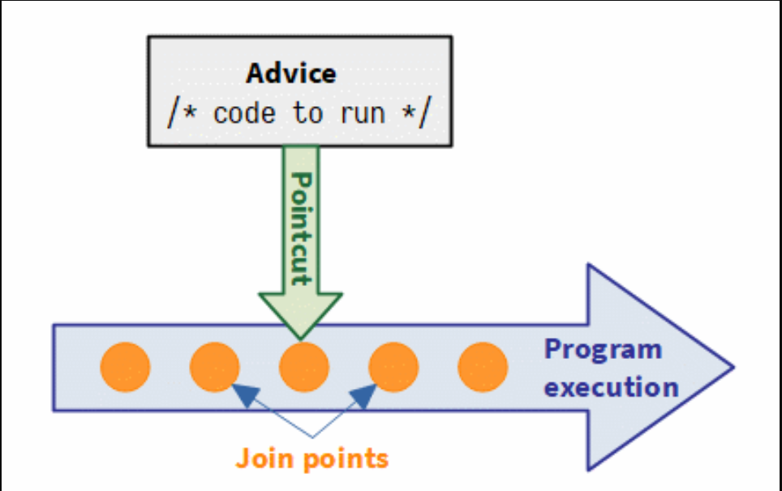
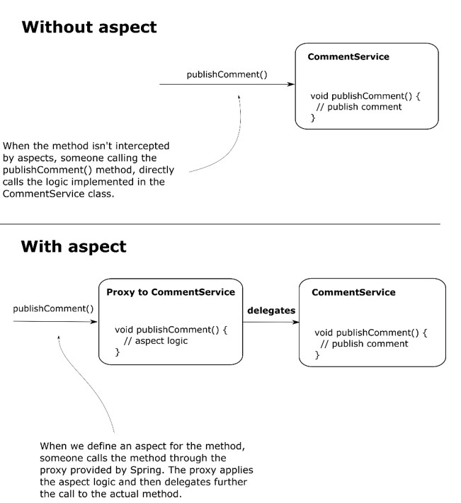
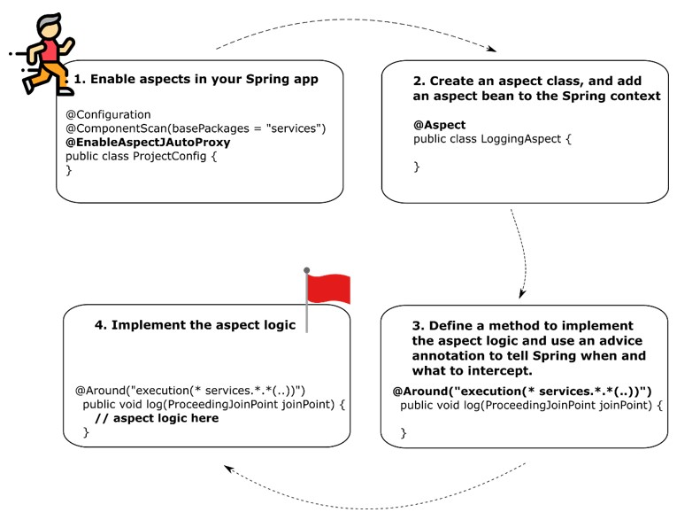

# Chapter 6. Using aspects with Spring AOP

Aspects are a way the framework intercepts method call and possibly alters the execution of the methods

- Transactionality is one of the main capabilities most apps use today to keep the persisted data's consistency.

- An aspect is simply a piece of logic the framework executes when you call specific methods of your choice. 
    - What code you want Spring to execute when you call specific methods. This is named an aspect.
    - When the app should execute this logic of the aspect(e.g., before or after method call, instead of the method call). This is named the advice.
    - Which methods the framework needs to instercept and execute the aspect for them. This is named a pointcut.
- Join Point: defines the event that trigger the execution of an aspect.
- As in the case of the dependency injection, to use aspects you need the framework to manage the objects for which you want to apply aspects.
- The bean that declares the method intercepted by an aspect is named the target object. To become an aspect target, the object need to be a bean in the Spring context.

"We want <u>some logic</u> (The aspect) to be executed <u>before</u> (the advice) each <u>execution</u> (The Join Point) of <u>method publishComment()</u> (The pointcut), which belongs to <u>the CommentService bean</u>(The target object).

Spring gives you an object that calls the aspect logic instead of the actual method. We say that Spring gives you a proxy object instead of the real bean. This approach is named weaving.

  

  

When we define an aspect for the method, someone calls the method through the proxy Spring provides. The proxy applies the aspect logic and then further delegates the call to the actual method.

In real-world apps, you don't use System.out to write messages in the console. A logging framework offers more flexibility in customizing the logging features and standardizing the logging messages.
    - Log4j.
    - Logback.
    - Java Logging API.

  

### To create an aspect, you follow these steps:
1. Enable the aspect mechanism in your Spring app by annotating the configuration class with the @EnableAspectJAutoProxy
2. Create a new class, and annotate it with the @Aspect annotation. Using either @Bean or stereotype, add a bean for this class in the Spring context.
3. Define a method that will implement the aspect logic and tell Spring when and which methods to intercept using an advice annotation.
4. Implement the aspect logic.

@EnableAspectJAutoProxy: Enable the aspects mechanism in our Spring app.

Using @Aspect, you tell Spring that the class implements the definition of an aspect, but Spring won't also create a bean for this class.
    - It's a common mistake to forget that annotating the class with @Aspect doesn't also add a bean to the context.

- AspectJ pointcut language. Theoretically, you can write very complex AspectJ pointcut expressions to identify a particular set of method calls to be intercepted. This language is really powerfull.
