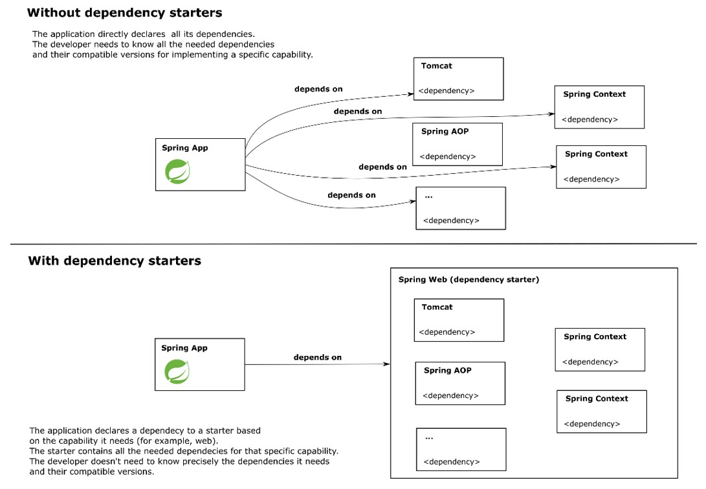

# Chapter 6. Understanding Spring Boot and Spring MVC

### A Web Application is Composed of Two Parts:

- **Client Side (Frontend):**
  - The user directly interacts with the client side.
  - The browser sends requests to a web server, receives responses, and provides an interface for user interaction.
  - Also referred to as the **frontend** of a web application.

- **Server Side (Backend):**
  - Receives requests from the client and sends back data in response.
  - Implements logic to process and sometimes store the data requested by the client before sending a response.
  - Also known as the **backend** of a web application.
  - Executes business logic, persists data in a database, and communicates with external services.
  - Capable of serving multiple clients concurrently.

### Approaches to Creating a Web Application:

1. **Monolithic Approach:**
   - The backend provides fully prepared views in response to client requests.
   - The server handles both data processing and view rendering.
   - **Pros:** Simpler architecture for small applications.
   - **Cons:** Can become cumbersome to maintain as the application grows.

2. **Frontend-Backend Separation:**
   - **Backend:**
     - Serves only raw data, typically in formats like JSON or XML.
     - Responds to requests representing user actions by executing logic and returning data.
     - Can send HTML, CSS, images, and scripts that the browser can interpret and execute.
   - **Frontend:**
     - A separate application running in the browser.
     - Retrieves data from the backend, processes it, and decides how to display the information.
   - **Pros:**
     - Modern approach that allows independent development and deployment of frontend and backend.
     - Enhances scalability and maintainability.
   - **Cons:** Requires more initial setup and coordination between frontend and backend teams.

### Communication Protocol:

- **HTTP (Hypertext Transfer Protocol):**
  - Used by web browsers to communicate with servers over the network.
  - Defines how clients and servers exchange data.

- **Servlet Container (Web Server):**
  - Acts as a translator for HTTP messages.
  - Transforms client requests into objects that the application can understand and process.

### Spring Boot

Spring Boot simplifies the development of Spring-based applications by minimizing the need for extensive configuration. It is particularly beneficial in environments with service-oriented architectures (SOA) and microservices, where rapid development and scalability are crucial.

#### Key Features of Spring Boot:

- **Simplified Project Creation:**
  - Quickly set up new Spring applications with minimal configuration.
  - Provides project templates and initial setup options.

- **Dependency Starters:**
  - Predefined sets of dependencies tailored for specific functionalities (e.g., web development, security, data access).
  - Simplifies the management of project dependencies by grouping commonly used libraries.

- **Autoconfiguration:**
  - Automatically configures the application based on the dependencies present in the project.
  - Reduces the need for manual configuration by providing sensible defaults.
  - Enables developers to focus on writing business logic rather than boilerplate code.

#### Benefits of Using Spring Boot:

- **Rapid Development:**
  - Accelerates the development process by providing out-of-the-box configurations and tools.
  
- **Microservices-Friendly:**
  - Ideal for building scalable and maintainable microservices architectures.
  
- **Flexible Deployment:**
  - Supports various deployment options, allowing frontend and backend to be managed and deployed independently.

  We let (and it's recommended) Spring Boot choose the version of a dependency to make sure we don't run into imcompatibilities.

  

The controller is a component of the web app that contains methods executed for a specific HTTP request

### Summary

- The client side (frontend) sends requests to the server side (backend). The backend executes the action requested by the frontend and responds back.
- Spring Boot: a Spring ecosystem project that applies the convention-over-configuration principle providing you default configurations for the capabilities your app needs.
- To get the HTTP requests and deliver the responses, a Java backend web app needs a servlet container (e.g., Tomcat): software with the capability to translate HTTP requests and responses to the Java app.
- To mark a class as a Spring MVC controller use the @Controller stereotype annotation. To assign a controller action to a specific HTTP request, use the @RequestMappging annotation.

# Key Takeaways

- **Client Side (Frontend):** User interface and interaction handled by the browser.
- **Server Side (Backend):** Business logic, data processing, and communication with databases or external services.
- **Monolithic vs. Frontend-Backend Separation:** Choose based on project complexity and scalability needs.
- **Spring Boot Features:** Simplifies project setup, manages dependencies effectively, and provides autoconfiguration to reduce manual effort.
- **HTTP Protocol:** Foundation for client-server communication in web applications.
- **Servlet Container:** Bridges the gap between HTTP requests and application logic.

These refined notes should provide a clearer and more accurate understanding of the concepts, aiding your study and comprehension of Spring Boot and Spring MVC.